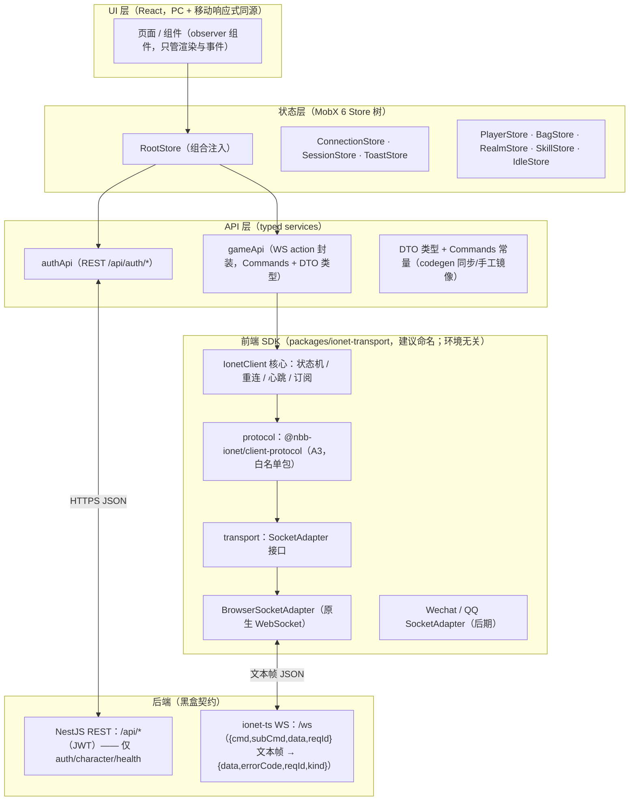

# 02 · 前端总体架构（通信层为核心）

> ⚠️ **状态提示（2026-09-13）**：本文件的设计结论（分层、接口切分、生命周期、多端差异表）**仍然有效**；
> 但涉及"后端现状/协议能力"的引用（串行队列、无 reqId、禁 import `@nbb-ionet/*`、WS 未启用等）已被协议加固推翻。
> 逐条勘误与实施基线见 [06-现状校正与实施基线（2026-09-13）](./06-现状校正与实施基线（2026-09-13）.md)。

> 前置阅读：`01-后端通信协议实录.md`（历史）与 [06-现状校正与实施基线](./06-现状校正与实施基线（2026-09-13）.md)（**当前**）。本文件解决三个问题：
> 1. 如何做到"前后端零耦合、一个后端接无数前端"；
> 2. 如何把 `{cmd, subCmd, data}` 信封做成可靠可用的请求/推送体系（含关联策略、重连、心跳、推送路由）；
> 3. 如何让同一套逻辑在「PC 浏览器 → 手机浏览器 → 微信/QQ 小程序」逐步落地。

---

## 1. 设计原则

| # | 原则 | 落地手段 |
|---|---|---|
| P1 | 协议即契约，框架不跨端 | 协议层用浏览器安全的 `@nbb-ionet/client-protocol`（A3）；**禁 import Node-only 的 `@nbb-ionet/*`**（`core-framework`/`external-server`/`extension-nestjs`/`redis`），A3 是白名单例外 |
| P2 | 通道可插拔 | `SocketAdapter` 接口隔离浏览器/小程序 WebSocket 差异；codec 直接复用 A3 的 `envelopeCodec`（JSON，未知字段透传） |
| P3 | 状态少碰 DOM | 连接状态、协议解析、重连策略全部在 SDK 与 Store 层，UI 只订阅 MobX 状态 |
| P4 | 向后兼容的容错解析 | 推送按 `kind='notification'` 分流，再按 `{cmd,subCmd}` / `{type}` 路由；对旧式裸透传形状容错 |
| P5 | 双通道并存、WS 为主 | REST（认证/角色/健康检查）与 WS（全部游戏交互）统一入口，**职责已由后端定死**（见 §4.2） |

---

## 2. 分层架构



**依赖方向单向下沉**：UI → Store → API → SDK → 平台。SDK 永远不知道 React/MobX/后端的任何细节。

---

## 3. 前端 SDK 设计（本方案的心脏）

> ⚠️ **范围校正（2026-09-13）**：协议层（信封类型、JSON codec、reqId 关联、kind 分流）**已由 `@nbb-ionet/client-protocol`（A3）提供**，
> 前端**不再自建协议层**（否则产生第二份协议真相）。本节类型定义已改为"A3 提供什么 / 前端只补什么"。
> A3 具体导出：`RequestMessage`/`ResponseMessage`/`NotificationMessage`/`WireFrame`/`ResponseKind`、`createRequestMessage`/`createResponseMessage`/`createNotificationMessage`/`isSuccess`、`envelopeCodec`、`classifyFrame`/`isNotificationFrame`、`RequestResponseAssociator`，以及 `./testing` 的 `ENVELOPE_GOLDENS`。

### 3.1 接口划分：A3 提供协议层，前端只补 transport + 核心类

```ts
// ── 来自 @nbb-ionet/client-protocol（A3）—— 不要重复定义 ──
import {
  envelopeCodec, RequestResponseAssociator, classifyFrame,
  type RequestMessage, type ResponseMessage, type NotificationMessage,
  type WireFrame, type ResponseKind,
} from '@nbb-ionet/client-protocol';

// ── 前端自建：transport（平台 WebSocket 差异全部收敛到这里）──
export interface SocketAdapter {
  connect(url: string, options?: SocketConnectOptions): void;
  send(data: string | Uint8Array): void;      // 只负责发原始帧
  close(code?: number, reason?: string): void;
  onOpen(handler: () => void): Unsubscribe;
  onMessage(handler: (frame: string | ArrayBuffer) => void): Unsubscribe;
  onClose(handler: (e: SocketCloseEvent) => void): Unsubscribe;
  onError(handler: (e: Error) => void): Unsubscribe;
  readonly readyState: 'connecting' | 'open' | 'closing' | 'closed';
}

// ── 前端自建：核心选项（WireRequest/WireResponse/WireFrame 改用 A3 类型）──
export interface IonetClientOptions {
  url: string;                        // ws(s)://.../ws
  adapterFactory?: () => SocketAdapter; // 默认 BrowserSocketAdapter
  correlation?: 'reqId' | 'serial';   // ★ 默认 'reqId'（服务端已支持回显）；'serial' 为兜底/调试
  heartbeat?: { intervalMs: number; timeoutMs: number }; // 默认 15s / 10s，复用 system.ping (1,1)
  reconnect?: { baseDelayMs?: number; maxDelayMs?: number; maxAttempts?: number | 'infinite' };
  authHandler?: () => Promise<string | undefined>; // 返回 JWT → 以 ?token= 拼进握手 URL
  onStateChange?: (s: ConnectionState) => void;
  onBusinessError?: (code: string, message: string) => void; // ★ 业务错误（data.success===false）回调
}
```

> **为什么不再定义 `EnvelopeCodec` 接口**：A3 的 `envelopeCodec` 已是 JSON + 未知字段透传的实现；后端约定的二进制（jprotobuf）为移植版私有格式，v1 不启用。若将来启用，在 A3 侧扩展而非前端另起一套。
> **`WireFrame` 判别**：A3 `classifyFrame` 按 `kind` 返回 `'response' | 'notification'`，前端只做路由。

### 3.2 请求关联策略（★ 已由协议加固改变默认选择）

**问题与现状**：~~响应不回显 `cmd/subCmd`，也没有 reqId~~ → **响应仍不回显 `cmd/subCmd`，但已支持 `reqId` 回显 + `kind='response'`**（`PROTOCOL.md §4/§4.1`）。

| 策略 | 机制 | 并发 | 后端配合 | 结论 |
|---|---|---|---|---|
| **A · reqId 请求字段（★ 当前默认）** | 请求带 `reqId` → 响应原样回显 `reqId` + `kind='response'` → A3 `RequestResponseAssociator` 精确配对（未命中回退"最早在途"） | **N** | ✅ 已支持（无需额外配置） | ✅ **默认采用**；面板可并行加载，慢 Action 不阻塞后续请求 |
| B · 串行队列 | 同一连接同一时刻只保留 1 个未决请求：发 `req` → 挂 Promise → 收到响应 → 按"最后一个请求"配对 → 队尾再发 | 1（推送不受限） | 无需 | 🧯 **兜底/调试选项**：协议调试、极端兼容场景；不再作为 v1 首选 |
| C · 事件 waitFor | 类 demo-client 的按 `type` 等待 | N | 仅适用于 `{type}` 自定义协议 | 仅作推送补充，不作请求机制 |

**实现要点**：SDK 把"配对算法"封装在 `correlation` 模块内（reqId / serial 两个实现同接口，reqId 实现直接复用 A3 的 `RequestResponseAssociator`），`request()` 返回的 Promise 与配对解耦——**默认 `correlation: 'reqId'`，需要时一行切换为 `'serial'`**，业务代码零改动。

> ⚠️ 兼容性：不带 `reqId` 的请求，响应**逐字节不变**（无 `reqId`/`kind`，`PROTOCOL.md §12.1`）——所以串行兜底永远可用。

### 3.3 连接生命周期（状态机）

```
idle ──connect()──▶ connecting ──open──▶ online ──close/error──▶ reconnecting ──backoff 后──▶ connecting
                      │                    │  ▲                          │
                      ▼                    ▼  └── 超过 maxAttempts ──▶ failed（触发人工介入 UI）
                 Auth/握手前置          visibilitychange/hidden、onLine→offLine 主动断开
```

- **断线重连**：指数退避 + 抖动（500ms 起，封顶 30s）；`maxAttempts: 'infinite'` + 前台可见才重连。
- **生命周期感知**：`visibilitychange`、`pagehide`、`navigator.onLine`/`online`/`offline` 事件全接入——移动浏览器切后台会冻结/掐断 WS，主动断开比被掐更可控。
- **应用层心跳**（关键，原因见 01 §4）：浏览器 JS 观察不到 WS ping/pong。SDK 用 `system.ping`（cmd=1, subCmd=1）做应用层心跳：15s 一发、10s 未收响应判定死链 → 主动重连。后端静默期与"心跳超时"冲突的解法：心跳响应唯一可预期，故此策略可靠。
- **断线语义**：`reconnecting` 期间所有 `request()` 入队等待或直接 reject（配置化）；重连成功后自动重放鉴权流程（§3.5），玩家可见状态由 `ConnectionStore` 驱动。

### 3.4 推送订阅（服务器主动下发的路由）

```ts
client.on({ cmd: 130, subCmd: 1 }, (payload) => { /* 挂机产线更新（idle 段） */ });
client.onType('room.tick', (payload) => { /* 兼容 {type} 信封 */ });
```

- 服务器推送信封**必带 `kind='notification'`**（A3 `isNotificationFrame` 可直接判定），再优先按 `cmd/subCmd`、无则按 `type` 路由（P4 容错）。
- 与请求不冲突：请求流水线只消费 `kind === 'response'` 且 `correlation` 判定的帧；推送另发。裸透传的旧形状（无 `kind`）按"非 response 即推送"容错处理。
- ⚠️ 判别值实际是 **`'notification'`**（不是早期设想的 `'push'`）。

### 3.5 认证 / 会话（★ 已定：握手段校验）

1. **REST 登录**：`POST /api/auth/login` → JWT → 存 `localStorage`/安全存储。
2. **WS 鉴权形态 = 握手鉴权**（`PROTOCOL.md §6`，后端已实现，Q1 关闭）：`authenticate` 在 upgrade 阶段校验，失败 **HTTP 401 拒升级**；成功则整条连接绑定 `userId`。
   - **浏览器（v1 主场景）**：`?token=<jwt>` —— 浏览器 `WebSocket` 无法设置握手头，这是**唯一可行通道**；`authHandler` 返回的 token 由 SDK 拼进握手 URL。
   - **Node / 小程序**：可改用 `Authorization: Bearer <jwt>`（小程序 `wx.connectSocket` 支持 header）——能力差异保留在适配器层。
   - ~~连接后首个 Action 验票~~：**不再需要**（那是握手钩子缺位时的权宜方案）。
   - ⚠️ token 进 URL 会进代理/访问日志：生产建议改为**短期握手 ticket**（REST 换取、一次性、短 TTL）。
3. **重连重鉴权**：token 过期 → `authHandler` 内先静默刷票（REST refresh）再重连；失败则登出。

### 3.6 时间同步（放置游戏专属）

离线收益需要"服务器时间 − 客户端时间"的偏差：
- 登录/心跳响应上携带服务端时间戳（后端若未提供，可在首 Action 响应里约定 `data.serverTime`）；
- SDK 记录 `localSinceEpoch + (serverSinceEpoch − localEpoch)` 得到时钟偏差，并在重连后重估；
- `IdleStore` 用该偏差计算离线流逝，避免本地改时钟刷收益。

### 3.7 SDK 测试策略（零后端也能开发）

- `SocketAdapter` 的 **Memory/Fake 适配器**：脚本化响应队列（按顺序回、按 cmd 回、注入错误帧）；
- 协议快照测试：固定输入 → 断言序列化后的 JSON 文本与预期逐字一致（锁死线协议）；
- 集成冒烟：Vite dev 用 `vite-plugin-mock` 或 Node 侧起一个迷你 `ws` mock server（几十行，复刻 01 §3 的服务端行为），跑通"登录 → 连接 → 心跳 → 推送到 UI"全链路。

---

## 4. 应用层（React + MobX）落地形态

### 4.1 Store 树

```
RootStore
├── ConnectionStore     // connectionState、latency、lastServerTimeOffset
├── SessionStore        // JWT、userId、登录态、重连 token 刷新
├── ToastStore          // 错误码 → 文案转译（400/404/500 + 业务码）
├── PlayerStore         // 角色面板（境界/灵韵/技能槽）
├── BagStore            // 物品/词缀
├── RealmStore          // 境界突破推演
├── SkillStore          // 功法图鉴/参悟
└── IdleStore           // 放置产线队列（依赖时间同步）
```

- Store 构造器注入依赖（RootStore 组装），**Store 内部只依赖 SDK 接口与 DTO 类型，不 import React**；
- 高频服务器推送 → store action 幂等合并（物品清单 diff、产线增量），避免整树替换触发全量 re-render。

### 4.2 REST / WS 职责划分（★ 已由后端定死）

- **当前后端事实**：REST = `auth`（注册/登录）、`character`（建号/查询）、`health`；**其余全部游戏交互走 WS**（12 个 Action，cmd 1/30/40/50/60/70/80/90/100/110/120/130）。
- `authApi`（REST）与 `gameApi`（WS）两个 service 是唯一知道"某业务走哪个通道"的地方，业务层不感知。
- ~~"后端逐步把实时域迁到 Action"~~：**迁移已完成**，无需前端做过渡兼容。

### 4.3 工程结构建议（本仓库内 monorepo 增量）

```
packages/
├── web/                   # React 应用（Vite，PC+移动浏览器）
│   └── src/{app, pages, components, stores, services, api}
├── ionet-transport/       # ★ 原计划名 ionet-client 与 A3 撞车，建议更名（或并入 web）
│   └── src/{client, transport, correlation}
└── shared-types/          # 业务 DTO 类型 + Commands（codegen 产物同步，脚本化，入库）
```

- **协议层不在此列**：直接依赖 workspace 包 `@nbb-ionet/client-protocol`（A3）。
- `web` 只 import `ionet-transport`、`shared-types` 与 A3；三者不含任何 DOM/Node 私有 API（微信/QQ 适配器是 `transport/wechat` 子目录，后期加入）。
- workspace 声明：根 `pnpm-workspace.yaml` 已含 `vendor/ionet-ts/packages/*`，可直接 `"@nbb-ionet/client-protocol": "workspace:*"`。

---

## 5. 多端就绪（PC/移动浏览器 → 微信/QQ 小程序）

| 关注点 | 浏览器（v1） | 微信小程序（后期） | QQ 小程序（后期） |
|---|---|---|---|
| Socket API | `new WebSocket(...)` | `wx.connectSocket({url, header})` + `wx.onSocketMessage` 等 | `qq.*` 与 wx 同构 |
| 自定义 header | ❌ 不支持（只能 query/cookie） | ✅ 支持 | ✅ 支持 |
| 帧类型 | string/Blob/ArrayBuffer | string/ArrayBuffer | 同左 |
| 存储 | localStorage | wx.setStorageSync | qq.setStorageSync |
| 生命周期 | visibilitychange | wx.onAppShow/onAppHide | 同左 |
| 网络事件 | online/offline | wx.onNetworkStatusChange | 同左 |
| 登录票据 | JWT/Bearer | wx.login code2session 换票 | 同左 |

- **结论**：差异全部落在 `SocketAdapter` + 平台工具模块里。业务/Store/SDK 核心零改动。
- **UI 层选择**：浏览端用纯 React；小程序端若追求复用组件，可评估 Taro（React 语法编译到小程序）或原生小程序 + 同一 Store 包；**决策点推迟到小程序立项时**，SDK 的适配器抽象使其不受影响。
- **警戒**：小程序基础库对 WS 心跳/断线/后台策略有平台差异，SDK 的 heartbeat 与重连参数需按环境覆盖（配置化，不做死）。

---

## 6. 交付物边界（本方案的范围）

- ✅ 本研究：协议契约、SDK 接口设计、关联策略、生命周期、Store 分层、多端适配、工程结构。
- ✅ 可直接开工：`packages/ionet-transport`（`BrowserSocketAdapter` + reqId 并发关联 + 心跳 + 退避重连），协议层复用 A3。
- ✅ **已由框架侧解决（原"待后端拍板"项）**：WS 握手鉴权、`reqId` 回显、广播/推送信封规范（`kind='notification'`）。
- ⏳ **仍需后端明确**：业务错误码表（Q5）、`serverTime` 字段（Q6）、生产部署形态（Q7）、是否启用 HTTP fallback（Q9）。
- ⚠️ **明确不做**：不重造协议层（信封/codec/关联），不与后端共享 Node-only 包——**A3 是唯一共享的浏览器安全包**。