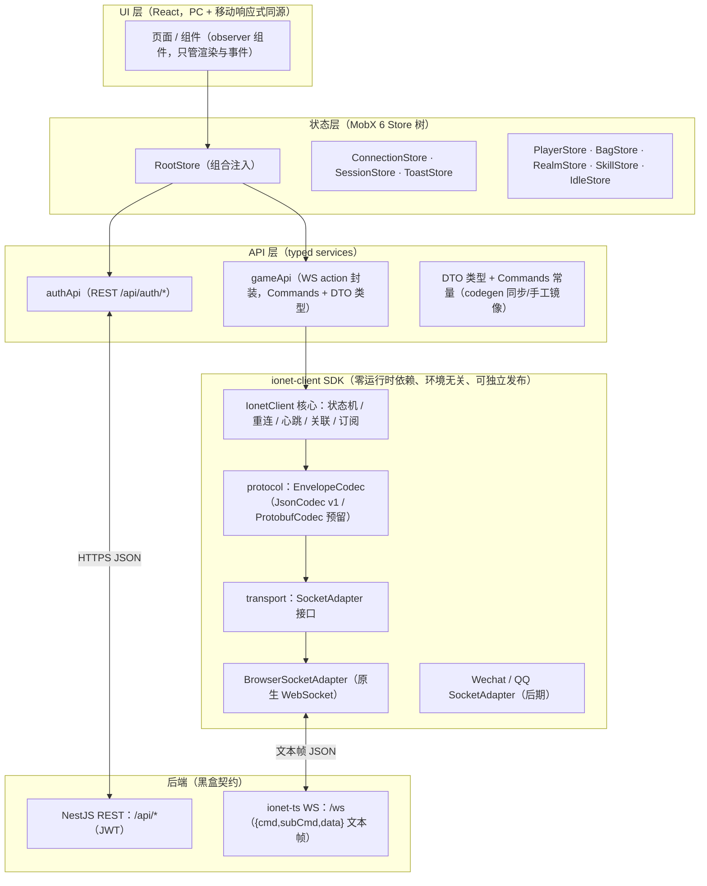

# 02 · 前端总体架构（通信层为核心）

> 前置阅读：`01-后端通信协议实录.md`。本文件解决三个问题：
> 1. 如何做到"前后端零耦合、一个后端接无数前端"；
> 2. 如何在不改后端的前提下，把 `{cmd, subCmd, data}` 信封做成可靠可用的请求/推送体系（含关联策略、重连、心跳、推送路由）；
> 3. 如何让同一套逻辑在「PC 浏览器 → 手机浏览器 → 微信/QQ 小程序」逐步落地。

---

## 1. 设计原则

| # | 原则 | 落地手段 |
|---|---|---|
| P1 | 协议即契约，框架不跨端 | 前端自建 `ionet-client` SDK，只认 §01-10 的线协议；**严禁 import `@nbb-ionet/*`**（Node-only，浏览器会炸） |
| P2 | 通道可插拔 | `SocketAdapter` 接口隔离浏览器/小程序 WebSocket 差异；`EnvelopeCodec` 接口隔离 JSON/二进制 |
| P3 | 状态少碰 DOM | 连接状态、协议解析、重连策略全部在 SDK 与 Store 层，UI 只订阅 MobX 状态 |
| P4 | 向后兼容的容错解析 | 推送信封支持 `{cmd,subCmd,data}` 与 `{type,data}` 两种形态路由 |
| P5 | 双通道并存 | REST（登录/注册/低频查询）与 WS（游戏实时）两个通道统一入口，后端决定各自承载什么 |

---

## 2. 分层架构



**依赖方向单向下沉**：UI → Store → API → SDK → 平台。SDK 永远不知道 React/MobX/后端的任何细节。

---

## 3. ionet-client SDK 设计（本方案的心脏）

### 3.1 三个接口、一个核心类

```ts
// ── transport：平台 WebSocket 差异全部收敛到这里 ──
export interface SocketAdapter {
  connect(url: string, options?: SocketConnectOptions): void;
  send(data: string | Uint8Array): void;      // 只负责发原始帧
  close(code?: number, reason?: string): void;
  onOpen(handler: () => void): Unsubscribe;
  onMessage(handler: (frame: string | ArrayBuffer) => void): Unsubscribe;
  onClose(handler: (e: SocketCloseEvent) => void): Unsubscribe;
  onError(handler: (e: Error) => void): Unsubscribe;
  readonly readyState: 'connecting' | 'open' | 'closing' | 'closed';
}

// ── protocol：协议信封编解码（可插拔）──
export interface EnvelopeCodec {
  readonly kind: 'json' | 'protobuf';
  encodeRequest(req: WireRequest): string | Uint8Array;   // {cmd,subCmd,data}
  decodeFrame(frame: string | Uint8Array): WireFrame;     // → 解析为可路由帧
}

// ── 线协议类型（本地声明，勿 import @nbb-ionet！与 01 §3 契约严格一致）──
export interface WireRequest { cmd: number; subCmd: number; data?: unknown; }
export interface WireResponse { data?: unknown; errorCode?: number; errorMessage?: string; }
export type WireFrame =
  | { kind: 'response'; response: WireResponse }
  | { kind: 'push'; cmd?: number; subCmd?: number; type?: string; data: unknown };

export interface IonetClientOptions {
  url: string;                        // ws(s)://.../ws
  codec?: EnvelopeCodec;              // 默认 JsonCodec
  adapterFactory?: () => SocketAdapter; // 默认 BrowserSocketAdapter
  correlation?: 'serial' | 'reqId';   // 'serial' v1 默认；'reqId' 待后端回显支持
  heartbeat?: { intervalMs: number; timeoutMs: number }; // 默认 15s / 10s
  reconnect?: { baseDelayMs?: number; maxDelayMs?: number; maxAttempts?: number | 'infinite' };
  authHandler?: () => Promise<string | undefined>; // 连接前取 token（query / header / 首 Action 由 options 決定）
  onStateChange?: (s: ConnectionState) => void;
}
```

### 3.2 请求关联策略（最重要的一步棋）

**问题**（来自 01 §3.2）：响应不回显 `cmd/subCmd`，也没有 reqId → 并发未决请求无法配对。

| 策略 | 机制 | 并发 | 后端配合 | 结论 |
|---|---|---|---|---|
| **A · 串行队列（v1 首选）** | 同一连接同一时刻只保留 1 个未决请求：发 `req` → 挂 Promise → 收到响应 → 按"最后一个请求"配对 → 队尾再发 | 1（广播推送不受限） | 无需 | ✅ 直接可用；放置游戏请求率低（每秒 1~5），完全够用 |
| B · reqId 请求头 | 请求带 `headers.requestId`，响应回显 | N | 需后端透传 headers 并回显（当前不支持，见 01 §3.2） | 🔜 协议升级路线，SDK 从第一天就保留该能力 |
| C · 事件 waitFor | 类 demo-client 的按 `type` 等待 | N | 仅适用于 `{type}` 自定义协议 | 仅作推送补充，不作请求机制 |

**实现要点**：SDK 把"配对算法"封装在 `correlation` 模块内（serial / reqId 两个实现同接口），`request()` 返回的 Promise 与配对解耦——**后端一旦支持 reqId 回显，前端只改一行配置**（`correlation: 'reqId'`），业务代码零改动。这就是"妥协于后端、又给后端留升级缝"的典型做法。

### 3.3 连接生命周期（状态机）

```
idle ──connect()──▶ connecting ──open──▶ online ──close/error──▶ reconnecting ──backoff 后──▶ connecting
                      │                    │  ▲                          │
                      ▼                    ▼  └── 超过 maxAttempts ──▶ failed（触发人工介入 UI）
                 Auth/握手前置          visibilitychange/hidden、onLine→offLine 主动断开
```

- **断线重连**：指数退避 + 抖动（500ms 起，封顶 30s）；`maxAttempts: 'infinite'` + 前台可见才重连。
- **生命周期感知**：`visibilitychange`、`pagehide`、`navigator.onLine`/`online`/`offline` 事件全接入——移动浏览器切后台会冻结/掐断 WS，主动断开比被掐更可控。
- **应用层心跳**（关键，原因见 01 §4）：浏览器 JS 观察不到 WS ping/pong。SDK 用 `system.ping`（cmd=1, subCmd=1）做应用层心跳：15s 一发、10s 未收响应判定死链 → 主动重连。后端静默期与"心跳超时"冲突的解法：心跳响应唯一可预期，故此策略可靠。
- **断线语义**：`reconnecting` 期间所有 `request()` 入队等待或直接 reject（配置化）；重连成功后自动重放鉴权流程（§3.5），玩家可见状态由 `ConnectionStore` 驱动。

### 3.4 推送订阅（服务器主动下发的路由）

```ts
client.on({ cmd: 60, subCmd: 3 }, (payload) => { /* 放置产线更新 */ });
client.onType('game_start', (payload) => { /* 兼容 {type} 信封 */ });
```

- 内部统一为 `WireFrame`：优先按 `cmd/subCmd`，无则按 `type`（P4 容错）。
- 与请求不冲突：请求流水线只消费 `kind === 'response'` 且 `correlation` 判定的帧；推送另发。

### 3.5 认证 / 会话（三形态兼容，待后端定夺）

1. **REST 登录**（当前事实）：`POST /api/auth/login` → JWT → 存 `localStorage`/安全存储。
2. **WS 鉴权形态**（由后端最终决定，SDK 三个钩子都预留）：
   - `?token=` 查询参数（最省事，但会进日志；生产可用短期 ticket）；
   - `Authorization`/自定义 header（浏览器 WebSocket 不支持自定义头！浏览器只能带 query/cookie——**小程序 wx.connectSocket 支持 header**，两端能力不对称，设计时注意）；
   - 连接后首个 Action 验票（`auth.loginVerify`，最正统的 ionet 风格，Java 版 orchestra 即此）。
3. **重连重鉴权**：token 过期 → `authHandler` 内先静默刷票（REST refresh）再重连；失败则登出。

### 3.6 时间同步（放置游戏专属）

离线收益需要"服务器时间 − 客户端时间"的偏差：
- 登录/心跳响应上携带服务端时间戳（后端若未提供，可在首 Action 响应里约定 `data.serverTime`）；
- SDK 记录 `localSinceEpoch + (serverSinceEpoch − localEpoch)` 得到时钟偏差，并在重连后重估；
- `IdleStore` 用该偏差计算离线流逝，避免本地改时钟刷收益。

### 3.7 SDK 测试策略（零后端也能开发）

- `SocketAdapter` 的 **Memory/Fake 适配器**：脚本化响应队列（按顺序回、按 cmd 回、注入错误帧）；
- 协议快照测试：固定输入 → 断言序列化后的 JSON 文本与预期逐字一致（锁死线协议）；
- 集成冒烟：Vite dev 用 `vite-plugin-mock` 或 Node 侧起一个迷你 `ws` mock server（几十行，复刻 01 §3 的服务端行为），跑通"登录 → 连接 → 心跳 → 推送到 UI"全链路。

---

## 4. 应用层（React + MobX）落地形态

### 4.1 Store 树

```
RootStore
├── ConnectionStore     // connectionState、latency、lastServerTimeOffset
├── SessionStore        // JWT、userId、登录态、重连 token 刷新
├── ToastStore          // 错误码 → 文案转译（400/404/500 + 业务码）
├── PlayerStore         // 角色面板（境界/灵韵/技能槽）
├── BagStore            // 物品/词缀
├── RealmStore          // 境界突破推演
├── SkillStore          // 功法图鉴/参悟
└── IdleStore           // 放置产线队列（依赖时间同步）
```

- Store 构造器注入依赖（RootStore 组装），**Store 内部只依赖 SDK 接口与 DTO 类型，不 import React**；
- 高频服务器推送 → store action 幂等合并（物品清单 diff、产线增量），避免整树替换触发全量 re-render。

### 4.2 REST / WS 职责划分（跟随后端）

- 当前后端事实（01 §6）：认证/角色/物品/功法/境界 = REST；ionet WS 仅 `ping`。
- 方案按"后端逐步把实时域迁到 Action"演进：`authApi/gameApi` 两个 service 是唯一知道"某业务走哪个通道"的地方，业务层不感知。

### 4.3 工程结构建议（本仓库内 monorepo 增量）

```
packages/
├── web/                  # React 应用（Vite，PC+移动浏览器）
│   └── src/{app, pages, components, stores, services, api}
├── ionet-client/         # SDK（零运行时依赖、可发布；本仓库内先以 workspace 包存在）
│   └── src/{core, protocol, transport, correlation}
└── shared-types/         # DTO 线协议类型 + Commands（由 codegen 产物同步，脚本化，入库）
```

`web` 只 import `ionet-client` 与 `shared-types`；两者不含任何 DOM/Node API（微信/QQ 适配器是 `transport/wechat` 子目录，后期加入，不进 web 包）。

---

## 5. 多端就绪（PC/移动浏览器 → 微信/QQ 小程序）

| 关注点 | 浏览器（v1） | 微信小程序（后期） | QQ 小程序（后期） |
|---|---|---|---|
| Socket API | `new WebSocket(...)` | `wx.connectSocket({url, header})` + `wx.onSocketMessage` 等 | `qq.*` 与 wx 同构 |
| 自定义 header | ❌ 不支持（只能 query/cookie） | ✅ 支持 | ✅ 支持 |
| 帧类型 | string/Blob/ArrayBuffer | string/ArrayBuffer | 同左 |
| 存储 | localStorage | wx.setStorageSync | qq.setStorageSync |
| 生命周期 | visibilitychange | wx.onAppShow/onAppHide | 同左 |
| 网络事件 | online/offline | wx.onNetworkStatusChange | 同左 |
| 登录票据 | JWT/Bearer | wx.login code2session 换票 | 同左 |

- **结论**：差异全部落在 `SocketAdapter` + 平台工具模块里。业务/Store/SDK 核心零改动。
- **UI 层选择**：浏览端用纯 React；小程序端若追求复用组件，可评估 Taro（React 语法编译到小程序）或原生小程序 + 同一 Store 包；**决策点推迟到小程序立项时**，SDK 的适配器抽象使其不受影响。
- **警戒**：小程序基础库对 WS 心跳/断线/后台策略有平台差异，SDK 的 heartbeat 与重连参数需按环境覆盖（配置化，不做死）。

---

## 6. 交付物边界（本方案的范围）

- ✅ 本研究：协议契约、SDK 接口设计、关联策略、生命周期、Store 分层、多端适配、工程结构。
- ✅ 可直接开工：`packages/ionet-client` SDK（JSON codec + BrowserSocketAdapter + serial correlation + 心跳重连）。
- ⏳ 待后端拍板后细化：WS 鉴权形态、reqId 回显、广播信封规范、业务错误码表。
- ⚠️ 明确不做：不与后端共享任何代码包（除非后端将来抽出纯协议层 npm 包且保证浏览器安全）。